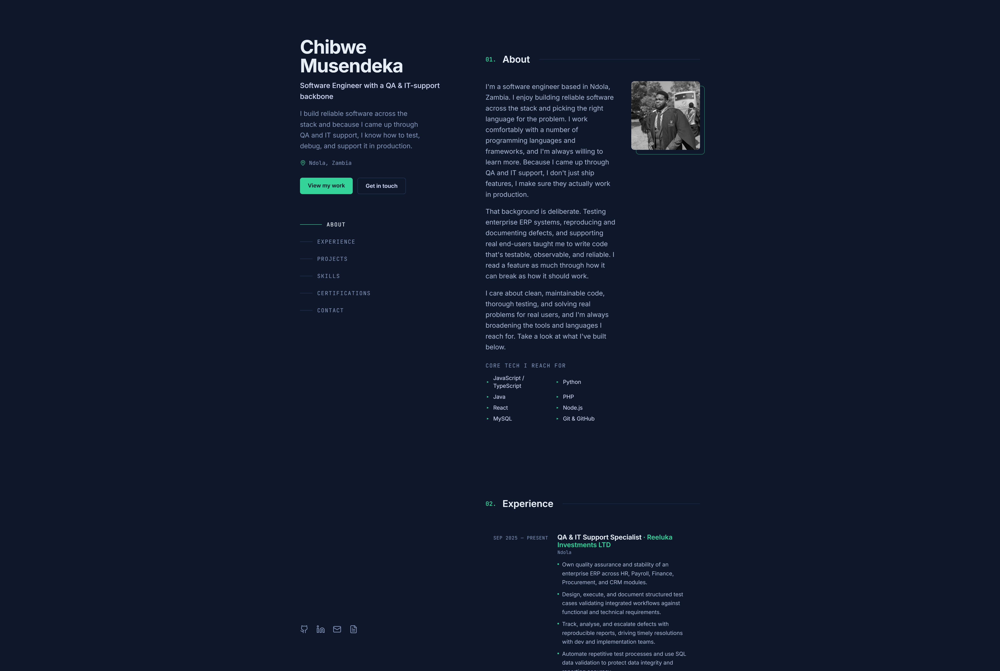

# Chibwe Musendeka — Portfolio

My personal developer portfolio: a fast, dark-themed single-page site that presents
my work as a **software engineer with a QA & IT-support background**. Built with
React 19 and pre-rendered to static HTML so it loads quickly, ranks well, and shows
proper link previews when shared.

**🔗 Live site: [chibwem.netlify.app](https://chibwem.netlify.app/)**



## Highlights

A few of the engineering decisions behind the site:

- **Build-time pre-rendering** with [`vite-react-ssg`](https://github.com/Daydreamer-riri/vite-react-ssg)
  — routes are rendered to real HTML at build time, so crawlers and social/link-preview
  bots see full content instead of an empty `<div id="root">`.
- **SEO & social ready** — per-page `<title>`/description, canonical URL, Open Graph
  and Twitter card tags, plus JSON-LD (`Person` + `WebSite`) structured data, a
  sitemap and robots.txt.
- **Accessible by default** — WCAG-AA colour contrast, keyboard focus styles, a skip
  link, and full support for `prefers-reduced-motion`.
- **Restrained motion** — subtle scroll reveals and hover micro-interactions using
  Framer Motion, animating only GPU-composited properties and firing once.
- **No-backend contact form** — [EmailJS](https://www.emailjs.com/) + `react-hook-form`
  with validation, degrading gracefully to a `mailto:` link if no keys are configured.
- **Content as data** — all copy lives in `src/data/*.ts`, so the site can be updated
  without touching component code.
- **Mobile-first & responsive** — a sticky sidebar/scrolling-content layout on desktop
  that collapses cleanly to a single column on phones.

## Tech stack

| Area | Choice |
| --- | --- |
| Framework | **React 19** + **TypeScript** |
| Build tool | **Vite** |
| Styling | **Tailwind CSS v4** (theme tokens via `@theme`) |
| Animation | **Motion** (Framer Motion) |
| Pre-rendering | **vite-react-ssg** (static HTML output) |
| Contact form | **@emailjs/browser** + **react-hook-form** |
| Icons | **lucide-react** |
| Fonts | **Inter** + **JetBrains Mono** (self-hosted via Fontsource) |
| Hosting | **Netlify** |

## Getting started

Prerequisites: **Node.js 20+**.

```bash
npm install
npm run dev        # start the dev server → http://localhost:5173
npm run build      # pre-render to /dist (static HTML)
npm run preview    # preview the production build locally
```

## Project structure

```
src/
  data/          # site content: profile, experience, projects, skills, certifications
  components/    # sections, layout (Sidebar), SEO, and motion primitives
  App.tsx        # sticky Sidebar + scrolling <main>
  main.tsx       # vite-react-ssg entry
public/          # static assets (résumé, headshot, favicon, robots, sitemap)
```

Content is centralised in `src/data/*.ts` — edit those files to update the copy.

## Environment variables

The contact form uses EmailJS. Copy `.env.example` to `.env` and provide:

```
VITE_EMAILJS_SERVICE_ID=...
VITE_EMAILJS_TEMPLATE_ID=...
VITE_EMAILJS_PUBLIC_KEY=...
```

Without these, the form falls back to opening the visitor's email client, so it never
breaks. For the deployed site, the same variables are set in Netlify's environment
settings.

## Deployment

Hosted on **Netlify**, configured via `netlify.toml`:

- Build command: `npm run build`
- Publish directory: `dist`
- Auto-deploys on every push to `main`.

## License & usage

Personal portfolio © Chibwe Musendeka. The source is public for reference and
learning — please don't reuse it wholesale as your own portfolio.
